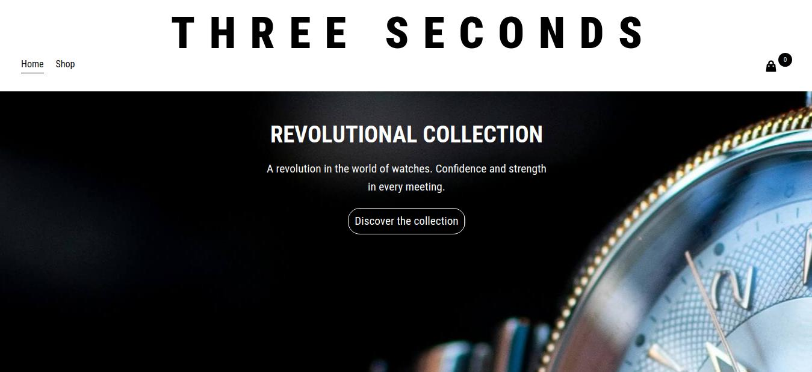
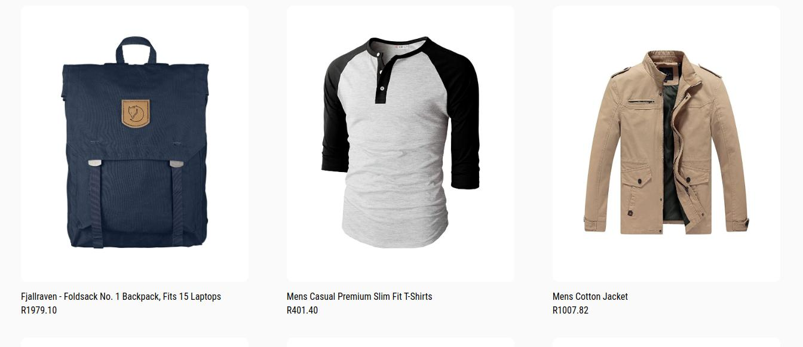

# Shopping Cart

A small e-commerce site where you can purchase your favorite products.

## Preview

This is a fictitious store that utilizes the FakeStore API to fetch products. The purpose of this project was to apply all React concepts learned thus far in The Odin Project.

For a live preview, click [here]().

## What I Learned

- I practiced the concepts covered in the React course.
- Explored how **useState** might function under the hood.
- Acquired knowledge about **CSS modules**.
- Gained experience in **testing React apps**.

## Contact

- [Instagram](https://instagram.com/q.codes__)
- [LinkedIn](https://www.linkedin.com/in/nqabenhle)
- Email: [nqabenhlemlaba22@gmail.com](mailto:nqabenhlemlaba22@gmail.com)

## Credits

- This project is part of [The Odin Project](https://www.theodinproject.com/).
- Design inspired by [Ally Adkinson](https://dribbble.com/adkinsondesign)'s [work](https://dribbble.com/shots/22204502-E-commerce-shop) on [Dribbble](https://dribbble.com).